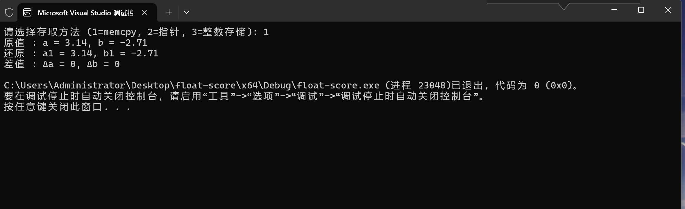

# 第四题 - 将两个 float 存入 char 数组并还原

该代码展示了三种方法将两个 `float` 类型的小数存入一个长度为 8 的 `char` 数组中，再从该数组中还原小数，并比较差值。

---
## 方法说明

1. **方法 1：memcpy拷贝字节**
   - 使用 memcpy 将每个 float 的字节内容直接复制到 char 数组中。
   
2. **方法 2：指针类型转换**
   - 将 char* 转换成 float*，直接写入数据。
   

3. **方法 3：转成整数再存**
   - 先将 float 的二进制表示存入 uint32_t，再写入 char 数组。
   
---

## 运行结果

